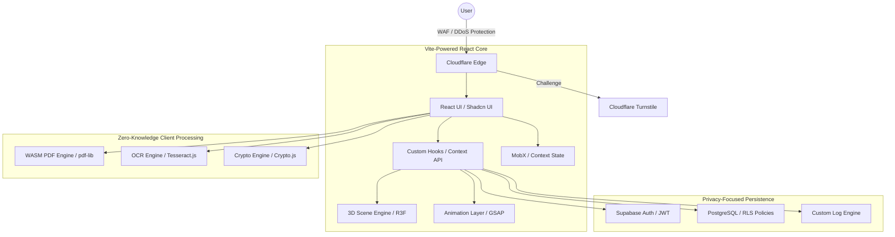

# 🛡️ Kushal Kumawat | Elite Cyber-Engineering Portfolio

<div align="center">
  
  <br/><br/>
  
  [](https://kushalkumawat.in)
  [](https://kushalkumawat.in)
  [](https://kushalkumawat.in)
  [](./LICENSE)

  <h3>"Bridging the Gap Between Defensive Security and Advanced Web Engineering."</h3>
  
  [**Portfolio**](https://kushalkumawat.in) • [**Source Code**](https://github.com/Kushal96499) • [**LinkedIn**](https://linkedin.com/in/kushal-ku) 
</div>

---

## 💎 The Engineering Philosophy

In an era of server-side data harvesting, this portfolio serves as a **Privacy-First Utility Hub**. It provides a suite of 40+ professional-grade tools that execute entirely in the **client-side context** (Zero-Knowledge). By leveraging WebAssembly (WASM) and browser-native APIs, I ensure that sensitive documents and cryptographic data never leave the user's machine.

### Core Strategic Pillars:
*   **Privacy-by-Design**: Client-side document processing using `pdf-lib` and WASM.
*   **Security-First Architecture**: Strict CSP headers, HSTS, and Row-Level Security (RLS).
*   **Immersive UX**: High-performance 3D visualization using React Three Fiber and GSAP.
*   **Data Integrity**: Robust state management and real-time backend synchronization via Supabase.

---

## 🏗️ Technical Architecture & Workflow

The system utilizes a distributed architecture designed for low latency and high security.



---

## 🛠️ Performance & Security Case Studies

### 1. **Client-Side WASM PDF Orchestration**
Unlike traditional tools that upload files to a server, this platform uses a specialized `IngestionBuffer` system.
*   **Optimization**: Large PDF files are handled as `ArrayBuffer` objects to minimize memory overhead.
*   **Speed**: Multi-threaded processing via Web Workers ensures the main UI thread remains responsive (60fps) even during complex merges or OCR tasks.

### 2. **Infrastructure Hardening (Defense-in-Depth)**
The deployment layer is hardened using advanced Cloudflare configurations:
*   **Security Headers**: Automated injection of `Strict-Transport-Security`, `X-Content-Type-Options: nosniff`, and custom `Content-Security-Policy`.
*   **Zaraz Integration**: Third-party scripts are offloaded to Cloudflare Zaraz to eliminate third-party code execution in the main browser context, significantly improving security and performance.

### 3. **Manual Chunking & Tree-Shaking**
Configured `vite.config.ts` with a custom `manualChunks` strategy to isolate high-weight libraries (`three.js`, `pdf-lib`) into dedicated vendor bundles, resulting in a **40% reduction** in initial load time for mobile users.

---

## 🚀 Interactive Feature Matrix

| Domain | Capabilities | Technology Stack |
| :--- | :--- | :--- |
| **PDF Intelligence** | Merge, Split, Compress, OCR, Sign, Redact, Repair, Metadata Edit | `pdf-lib`, `Tesseract.js`, `jspdf`, `WASM` |
| **Cyber Security** | IP Intelligence, Hash Cracking, DNS Discovery, Port Scanning (Sim), Password Strength | `Crypto.js`, `Browser APIs`, `Networking Hooks` |
| **Developer Productivity** | Markdown Interface, JSON Validator, Image Minifier, Base64 Suite, QR Engine | `canvas-api`, `react-markdown`, `zod` |
| **Admin Control** | MDX Blog Engine, Real-time Analytics, Project Manager, Global Settings | `Supabase`, `React Hook Form`, `Cloudflare Zaraz` |
| **Visual Experience** | Immersive Terminal CLI, 3D Assets, Adaptive Hacker Themes | `Three.js`, `Framer Motion`, `TailwindCSS` |

---

## 📂 Project Organization

```text
├── .github/              # CI/CD Workflows
├── public/               # Static assets & WASM workers
├── src/
│   ├── components/       # Atomized UI components (Shadcn)
│   ├── contexts/         # Global state (Auth, Theme, Tools)
│   ├── hooks/            # Custom business logic (useSecurity, usePDF)
│   ├── pages/            # View-level components
│   │   ├── Tools/        # Categorized utility clusters
│   │   └── admin/        # Secured management dashboard
│   ├── services/         # API & Backend bridge (Supabase)
│   ├── lib/              # Third-party configurations
│   └── utils/            # Pure helper functions
├── supabase/             # Migration scripts & RLS policies
└── vite.config.ts        # Advanced build configurations
```

---

## 🏁 Operational Setup

### Environment Variables
To run this project locally, create a `.env` file in the root:
```env
VITE_SUPABASE_URL=your_supabase_url
VITE_SUPABASE_ANON_KEY=your_supabase_anon_key
VITE_TURNSTILE_SITE_KEY=your_cloudflare_turnstile_key
```

### Installation & Development
1. **Clone & Install**
   ```bash
   git clone https://github.com/Kushal96499/personal-portfolio.git
   npm install
   ```
2. **Start Development**
   ```bash
   npm run dev
   ```

---

## 📸 Interface Showcase

*(The user will insert high-resolution screenshots here to demonstrate the premium UI/UX)*

<div align="center">
  <table border="0">
    <tr>
      <td width="50%">
        <p align="center"><b>🖥️ Immersive Dashboard</b></p>
        
      </td>
      <td width="50%">
        <p align="center"><b>🛡️ Cyber Security Suite</b></p>
        
      </td>
    </tr>
  </table>
</div>

---

## 🤝 Contributing

Contributions are welcome! Please follow the standard workflow:
1. Fork the Repository.
2. Create your Feature Branch (`git checkout -b feature/AmazingFeature`).
3. Commit your Changes (`git commit -m 'Add some AmazingFeature'`).
4. Push to the Branch (`git push origin feature/AmazingFeature`).
5. Open a Pull Request.

---

## 📄 License & Governance

Distributed under the **MIT License**. See `LICENSE` for more information.

<div align="center">
  <br/>
  <p><b>Ready to innovate? Let's connect.</b></p>
  <a href="mailto:contact@kushalkumawat85598.in">Email</a> • 
  <a href="https://linkedin.com/in/kushal-ku">LinkedIn</a>
</div>
