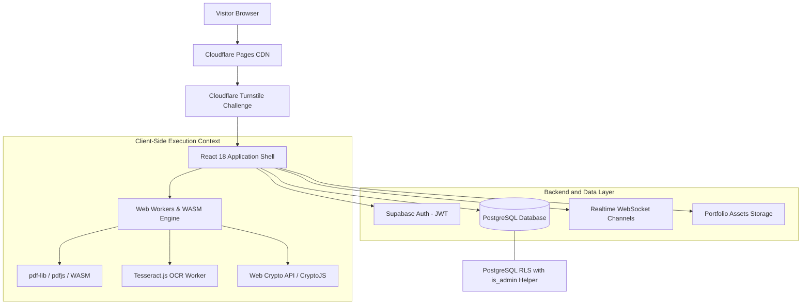

# Kushal Kumawat - Personal Portfolio and Web Tools Platform

A production-grade personal portfolio and browser-based utility platform built with React, TypeScript, Vite, Tailwind CSS, and Supabase. The application functions both as a professional portfolio showcasing projects, experience, and certifications, and as a privacy-focused toolbox containing over 40 client-side utilities for cybersecurity analysis, document processing, and developer tasks.

- **Live URL**: https://kushalkumawat.in
- **Repository**: https://github.com/Kushal96499/personal-portfolio
- **Author**: Kushal Kumawat (Web Developer & Cybersecurity Enthusiast)

---

## Table of Contents

- [Overview](#overview)
- [Core Architecture](#core-architecture)
- [Feature Breakdown](#feature-breakdown)
  - [1. Cybersecurity Tools](#1-cybersecurity-tools)
  - [2. Client-Side Document and PDF Suite](#2-client-side-document-and-pdf-suite)
  - [3. Developer and Daily Utilities](#3-developer-and-daily-utilities)
  - [4. Portfolio and Administrative Dashboard](#4-portfolio-and-administrative-dashboard)
- [Security Architecture and RLS Design](#security-architecture-and-rls-design)
  - [Content Security Policy (CSP)](#content-security-policy-csp)
  - [Cloudflare Turnstile Verification Gate](#cloudflare-turnstile-verification-gate)
  - [Database Row-Level Security (RLS)](#database-row-level-security-rls)
- [Performance and Build Optimizations](#performance-and-build-optimizations)
- [Project Structure](#project-structure)
- [Local Development Setup](#local-development-setup)
  - [Prerequisites](#prerequisites)
  - [Installation Steps](#installation-steps)
  - [Environment Variables](#environment-variables)
  - [Available Scripts](#available-scripts)
- [Deployment Configuration](#deployment-configuration)
- [License](#license)
- [Contact](#contact)

---

## Overview

Most online utility sites (PDF editors, converters, token inspectors) transmit user-uploaded files and tokens across the network to remote backend servers for processing. This platform is built around a zero-knowledge, client-side execution model:

1. **Zero Data Transmission**: Files, PDFs, tokens, and credentials remain entirely in the visitor's local browser memory (`ArrayBuffer` / `Blob`). Nothing is uploaded to any server.
2. **WebAssembly and Web Workers**: Computation-intensive jobs such as optical character recognition (OCR) and PDF manipulation run in background Web Workers to maintain a smooth 60fps main thread.
3. **Defense-in-Depth Web Security**: The site enforces strict HTTP response headers, Content Security Policy rules, bot verification via Cloudflare Turnstile, and non-recursive Row-Level Security on Supabase PostgreSQL.

---

## Core Architecture


```mermaid
graph TD
    Client[Visitor Browser] --> Edge[Cloudflare Pages CDN]
    Edge --> Gate[Cloudflare Turnstile Challenge]
    Gate --> App[React 18 Application Shell]

    subgraph Client-Side Execution Context
        App --> WorkerPool[Web Workers & WASM Engine]
        WorkerPool --> PDFEngine[pdf-lib / pdfjs / WASM]
        WorkerPool --> OCREngine[Tesseract.js OCR Worker]
        WorkerPool --> CryptoEngine[Web Crypto API / CryptoJS]
    end

    subgraph Backend and Data Layer
        App --> SupabaseAuth[Supabase Auth - JWT]
        App --> SupabaseDB[(PostgreSQL Database)]
        App --> SupabaseRT[Realtime WebSocket Channels]
        App --> SupabaseStorage[Portfolio Assets Storage]
    end

    SupabaseDB --- RLS[PostgreSQL RLS with is_admin Helper]
```

---

## Feature Breakdown

### 1. Cybersecurity Tools
A suite of utilities designed for web security inspection, network analysis, and vulnerability assessment:
- **Security Headers Analyzer**: Evaluates HTTP response headers (`CSP`, `HSTS`, `X-Frame-Options`, `Permissions-Policy`) and provides grading and remediation steps.
- **CORS Misconfiguration Tester**: Tests cross-origin resource sharing policies against custom origins to detect permissive wildcard access and missing credentials checks.
- **Cookie Security Evaluator**: Verifies `Secure`, `HttpOnly`, `SameSite`, and expiry attributes on browser cookies.
- **Input Reflection Tester**: Tests input sanitization behavior against reflected payloads for common XSS patterns.
- **Parameter Discovery**: Discovers and enumerates hidden GET/POST parameters on target endpoints.
- **JWT Analyzer and Decoder**: Parses header, payload, and signature components of JSON Web Tokens without sending secrets to any external server.
- **Hash and Password Tools**: Generate cryptographic hashes (MD5, SHA-1, SHA-256, SHA-512) and evaluate password entropy with zxcvbn-based scoring.
- **Network Reconnaissance Simulation**: IP lookups, DNS records inspection, and attack surface overview simulators.

### 2. Client-Side Document and PDF Suite
A full-featured PDF manipulation toolkit that runs without uploading files:
- **Page Management**: Merge multiple PDFs, split documents into ranges, extract pages, rotate pages, and delete unwanted pages.
- **Document Protection and Redaction**: Apply user/owner passwords to PDF files, unlock encrypted PDFs, and permanently redact sensitive text and image areas.
- **Content and Extraction**: Optical Character Recognition (OCR) via `tesseract.js` directly in a browser worker, page numbering, custom watermarking, and metadata editing.
- **Memory Management**: Large files are handled via chunked `ArrayBuffer` allocations and cleaned up after execution to avoid browser memory leaks.

### 3. Developer and Daily Utilities
- **Converters and Translators**: Base64 encoding/decoding, URL encoding, Markdown-to-HTML converter with live preview, and regex tester with regex flag support.
- **Image Processing**: Client-side image compression and format conversion using the HTML5 Canvas API.
- **Business Tools**: Professional GST invoice generator, general invoice generator, EMI loan calculator, and GST tax calculator.
- **Utility Tools**: QR code generator with custom styling and error-correction levels, color picker, and date/time calculation tools.

### 4. Portfolio and Administrative Dashboard
- **Dynamic Content**: Interactive terminal emulator, 3D experience views (powered by React Three Fiber), skill matrix, projects showcase, blog posts, and client testimonials.
- **Admin Control Panel**: Secured routes under `/admin/*` allowing the portfolio owner to manage project items, write blog entries, update resume details, inspect contact leads, and toggle site sections.
- **Real-Time Synchronisation**: Site control states and resume updates sync in real time across sessions using Supabase WebSocket broadcast channels.

---

## Security Architecture and RLS Design

### Content Security Policy (CSP)
The application defines a strict CSP in `public/_headers` to eliminate XSS vectors while allowing legitimate dependencies:

```http
Content-Security-Policy: default-src 'self'; script-src 'self' 'unsafe-inline' 'unsafe-eval' https://challenges.cloudflare.com https://static.cloudflareinsights.com https://*.cloudflare.com https://www.googletagmanager.com https://www.google-analytics.com https://cdn.jsdelivr.net; style-src 'self' 'unsafe-inline' https://api.fontshare.com https://fonts.googleapis.com; font-src 'self' data: https://api.fontshare.com https://fonts.gstatic.com; img-src 'self' data: blob: https:; connect-src 'self' https://*.supabase.co wss://*.supabase.co https://challenges.cloudflare.com https://*.cloudflare.com https://static.cloudflareinsights.com https://www.google-analytics.com https://www.googletagmanager.com; frame-src 'self' https://challenges.cloudflare.com; worker-src 'self' blob:; child-src 'self' blob: https://challenges.cloudflare.com; object-src 'none'; base-uri 'self';
```

- Explicit permissions for `https://*.supabase.co` (REST endpoints) and `wss://*.supabase.co` (Realtime WebSockets).
- Cloudflare Turnstile challenge origins explicitly whitelisted under `frame-src`, `script-src`, and `connect-src`.
- Unrestricted wildcards (`https:`) are avoided in `connect-src` to prevent unauthorized data exfiltration.

### Cloudflare Turnstile Verification Gate
- All incoming visitors are verified through an interactive Cloudflare Turnstile challenge before unlocking the portfolio view.
- Loaded with `?render=explicit` to prevent race conditions with the React lifecycle.
- An onload bridge synchronizes the global `window.turnstile` script with `react-turnstile`'s promise handler to guarantee immediate widget initialization.

### Database Row-Level Security (RLS)
Supabase PostgreSQL tables (`admin_users`, `resume_data`, `site_controls`, `contact_messages`, `leads`) have RLS strictly enabled. 

To eliminate self-referential policy recursion on `admin_users`, administrative checks use a dedicated `SECURITY DEFINER` function with a locked search path:

```sql
CREATE OR REPLACE FUNCTION public.is_admin(user_id uuid DEFAULT auth.uid())
RETURNS boolean
LANGUAGE sql
SECURITY DEFINER
SET search_path = public, pg_temp
STABLE
AS $$
  SELECT EXISTS (
    SELECT 1 FROM public.admin_users WHERE admin_users.user_id = is_admin.user_id
  );
$$;
```

This ensures:
- Anonymous visitors can safely read public tables (`resume_data`, `projects`, `skills`) without recursion errors.
- Protected tables (`admin_users`, `contact_messages`) are strictly inaccessible to unauthorized users.
- The Supabase `service_role` secret is never bundled or exposed in frontend code.

---

## Performance and Build Optimizations

- **Vite SWC Compilation**: Uses `@vitejs/plugin-react-swc` for fast build and HMR cycles.
- **Rollup Manual Chunk Splitting**: Heavy libraries that are only needed on demand are isolated into separate vendor bundles:
  - `graphics-vendor`: Isolated `three`, `@react-three/fiber`, and `@react-three/drei`.
  - `engine-vendor`: Isolated `pdf-lib`, `tesseract.js`, `xlsx`, `jszip`, `jspdf`, `mammoth`, and `fabric`.
- **Node Polyfill Isolation**: Buffer and stream polyfills required by legacy document parsers are scoped to browser shims without leaking into global initialization order.

---

## Project Structure

```text
personal-portfolio/
├── public/                       # Static assets, Web Worker scripts, and HTTP headers
│   ├── _headers                  # Cloudflare Pages security and cache headers
│   ├── _redirects                # SPA routing rewrites
│   ├── pdf.worker.min.mjs        # PDF.js background worker
│   └── site.webmanifest          # PWA web manifest
├── src/
│   ├── components/               # Reusable UI components (Shadcn UI, Radix primitives)
│   │   ├── ui/                   # Buttons, dialogs, dropdowns, inputs, cards
│   │   ├── Resume.tsx            # Interactive resume section with live fallback
│   │   ├── SecurityCheck.jsx     # Turnstile verification gate component
│   │   └── Terminal.tsx          # Interactive command-line portfolio component
│   ├── contexts/                 # Global state providers (Auth, SiteControls, Branding)
│   ├── layouts/                  # Base layouts (GlobalLayout, AdminLayout)
│   ├── pages/
│   │   ├── Index.tsx             # Main landing page
│   │   ├── admin/                # Authenticated administrative dashboards
│   │   └── Tools/                # Tool implementations organized by category
│   │       ├── Cyber/            # Security, network, and token inspection tools
│   │       ├── PDF/              # Client-side PDF manipulation pages
│   │       ├── Developer/        # Code, formatting, and conversion tools
│   │       └── Business/         # Invoices and financial calculators
│   ├── services/                 # Supabase client and query services
│   ├── types/                    # TypeScript interfaces and database schemas
│   ├── App.tsx                   # Main router and gatekeeper component
│   ├── main.tsx                  # Application bootstrap and polyfills
│   └── index.css                 # Tailwind directives and CSS variables
├── supabase/
│   ├── migrations/               # PostgreSQL migration scripts and RLS definitions
│   └── functions/                # Supabase edge functions
├── index.html                    # HTML shell, preconnect links, and Turnstile script
├── tailwind.config.ts            # Tailwind theme tokens and animations
└── vite.config.ts                # Build configuration and manual chunking rules
```

---

## Local Development Setup

### Prerequisites
- Node.js (version 18.x or 20.x recommended)
- npm, pnpm, or yarn
- A Supabase project instance (optional for read-only portfolio browsing)

### Installation Steps

1. **Clone the repository**:
   ```bash
   git clone https://github.com/Kushal96499/personal-portfolio.git
   cd personal-portfolio
   ```

2. **Install project dependencies**:
   ```bash
   npm install
   ```

3. **Configure Environment Variables**:
   Create a `.env` file in the project root:
   ```env
   VITE_SUPABASE_URL=https://your-project.supabase.co
   VITE_SUPABASE_ANON_KEY=your-supabase-anon-key
   VITE_TURNSTILE_SITE_KEY=1x00000000000000000000AA
   ```
   > Note: `1x00000000000000000000AA` is Cloudflare's official dummy test sitekey for local development that always passes verification.

4. **Start the development server**:
   ```bash
   npm run dev
   ```
   The local server will start on `http://localhost:8080`.

5. **Build and validate the production bundle**:
   ```bash
   npm run build
   ```
   To test the production build locally:
   ```bash
   npm run preview
   ```

---

## Deployment Configuration

This project is configured for deployment on **Cloudflare Pages**:

- **Build Command**: `npm run build`
- **Build Output Directory**: `dist`
- **Node.js Version**: 18.x or 20.x
- **Headers & Redirects**: Managed automatically through `public/_headers` and `public/_redirects`.

---

## License

This project is open-source software licensed under the [MIT License](./LICENSE).

---

## Contact

- **Kushal Kumawat**
- **Website**: [kushalkumawat.in](https://kushalkumawat.in)
- **LinkedIn**: [linkedin.com/in/kushal-ku](https://linkedin.com/in/kushal-ku)
- **GitHub**: [@Kushal96499](https://github.com/Kushal96499)
- **Email**: contact@kushalkumawat85598.in
