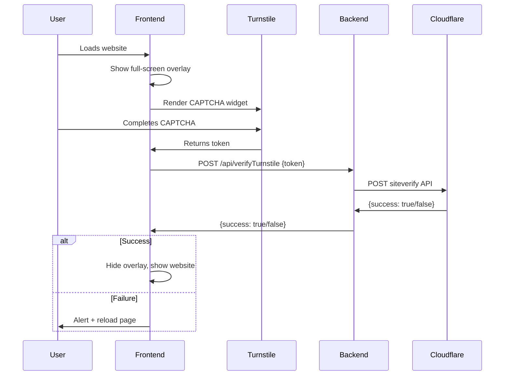

# Cloudflare Turnstile Full-Page Verification - Setup Guide

## 📋 Overview

Your website now has a full-page Cloudflare Turnstile CAPTCHA verification gate that blocks access until users complete verification. The token is validated server-side via Cloudflare Pages Functions.

---

## ✅ What Was Implemented

### 1. **Backend - Cloudflare Pages Function**
- **File:** `functions/api/verifyTurnstile.js`
- **Endpoint:** `/api/verifyTurnstile`
- **Method:** POST
- **Purpose:** Validates Turnstile tokens with Cloudflare's siteverify API

### 2. **Frontend - Full-Screen Overlay**
- **File:** `index.html`
- **Features:**
  - Full-screen dark cyber-themed overlay
  - Turnstile widget integration
  - Backend token verification
  - Smooth fade-out animation on success
  - Error handling with page reload
  - Scroll lock until verified
  - Cursor visibility maintained

---

## 🔧 Setup Instructions

### Step 1: Get Your Turnstile Keys

1. Go to [Cloudflare Dashboard](https://dash.cloudflare.com/)
2. Navigate to **Turnstile** section
3. Create a new site or use existing one
4. Copy your **Site Key** and **Secret Key**

### Step 2: Update Site Key in Code

Open `index.html` and replace the placeholder:

```javascript
const TURNSTILE_SITE_KEY = "YOUR_SITE_KEY_HERE"; // Replace with your actual site key
```

**Replace with your actual site key**, for example:
```javascript
const TURNSTILE_SITE_KEY = "0x4AAAAAAAdBD9loepcdroyQ";
```

### Step 3: Set Environment Variable in Cloudflare Pages

1. Log into [Cloudflare Dashboard](https://dash.cloudflare.com/)
2. Go to **Pages** → Select your project
3. Click **Settings** → **Environment variables**
4. Add new variable:
   - **Variable name:** `TURNSTILE_SECRET_KEY`
   - **Value:** Your Turnstile secret key (from Step 1)
   - **Environment:** Production (and Preview if needed)
5. Click **Save**

### Step 4: Deploy to Cloudflare Pages

```bash
# Commit your changes
git add .
git commit -m "Add Turnstile verification gate"
git push origin main
```

Cloudflare Pages will automatically deploy your changes.

---

## 🧪 Testing

### Local Development (Limited)
```bash
npm run dev
```

**Note:** The overlay and widget will appear, but backend verification will fail since Cloudflare Pages Functions only work in production/preview environments.

### Production Testing

1. Visit your deployed Cloudflare Pages URL
2. You should see the "Security Verification" overlay
3. Complete the Turnstile CAPTCHA
4. On success: overlay fades out, website appears
5. On failure: alert shows and page reloads

---

## 🔍 How It Works



---

## 📁 File Structure

```
e:\Projects\Personal Portfolio\
├── functions/
│   └── api/
│       └── verifyTurnstile.js    ← Backend verification
├── index.html                     ← Frontend overlay & logic
└── src/
    └── ...                        ← Your React app
```

---

## 🚨 Troubleshooting

### Issue: "CAPTCHA script not loaded"
- **Cause:** Turnstile script failed to load
- **Fix:** Check internet connection, verify CSP allows `challenges.cloudflare.com`

### Issue: "Network error" during verification
- **Cause:** Backend function not deployed or environment variable missing
- **Fix:** 
  1. Ensure deployed to Cloudflare Pages
  2. Verify `TURNSTILE_SECRET_KEY` is set in dashboard
  3. Check browser console for errors

### Issue: "Verification failed" even after completing CAPTCHA
- **Cause:** Invalid secret key or site key mismatch
- **Fix:**
  1. Verify site key in `index.html` matches your Turnstile site
  2. Verify secret key in environment variables is correct
  3. Check Cloudflare Turnstile dashboard for domain restrictions

### Issue: Widget doesn't appear
- **Cause:** Site key not updated
- **Fix:** Replace `YOUR_SITE_KEY_HERE` in `index.html` with your actual site key

---

## 🔐 Security Notes

- ✅ Token verification happens server-side (secure)
- ✅ Secret key stored in environment variables (not in code)
- ✅ CORS enabled for local development
- ✅ Proper error handling prevents bypass attempts
- ✅ Token expiration triggers page reload

---

## 📝 Environment Variables Reference

| Variable | Location | Purpose |
|----------|----------|---------|
| `TURNSTILE_SECRET_KEY` | Cloudflare Pages Dashboard | Validates tokens with Cloudflare API |

Set in: **Cloudflare Dashboard → Pages → [Your Project] → Settings → Environment variables**

---

## ✨ Features

✅ Full-screen verification overlay  
✅ Backend token validation (secure)  
✅ Smooth fade-out animation  
✅ Error handling with auto-reload  
✅ Cursor visibility maintained  
✅ Scroll lock during verification  
✅ Status messages for user feedback  
✅ Works on Cloudflare Pages (static hosting)  
✅ No localStorage bypass possible  

---

## 🎯 Next Steps

1. ✅ Replace `YOUR_SITE_KEY_HERE` in `index.html` with your actual site key
2. ✅ Set `TURNSTILE_SECRET_KEY` in Cloudflare Pages environment variables
3. ✅ Deploy to Cloudflare Pages
4. ✅ Test the verification flow
5. ✅ Monitor Cloudflare Turnstile analytics dashboard

---

**Need help?** Check the [Cloudflare Turnstile Documentation](https://developers.cloudflare.com/turnstile/)
